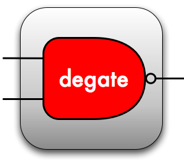

 

Degate 2.0
===========

This project is a fork of the Degate project, the final goal is to replace it.

Degate is a software for semi-automatic VLSI reverse engineering of digital logic in chips.

# The project

## Little history

Degate was actively developed by Martin Schobert, during his thesis, from ~2009 to 2011. For now, the project is inactive and only get some small fixes since 2011. It is composed of a library (libGate) and a GUI interface (Degate). Degate was known to be unstable and have impacting bugs in a first place. The software is the only known open-source project for semi-automatic VLSI reverse engineering.

Degate has definitely a great potential, mainly because it is the only free and open-source software for hardware reverse engineering of chips, but never knew how to impose itself in the community.

You can visit the initial project website to learn more :

  http://degate.org

## Current status

This project aims to totally replace the old Degate, with a focus on Windows and Linux support, getting better stability and general modernization. To achieve this the aim was to drop GTK and move to Qt and merge the lib and the GUI part of the project. Another objective was to minimize the number of dependencies, for now it uses only Boost and Qt and the mid-term objective is to only keep Qt and remove Boost.

We want to have fewer bugs as possible, even if some functionality needs to be dropped (for the moment). The stability was the main problem of the old Degate and the main reason why the community hadn't already united around it.

For the moment we have (as functionalities) :
- OpenGL 3 support (better performances and evolutive),
- Qt (bunch of tools, open-source and easy cross-platform),
- Multi-platform support (tested on Linux and Windows),
- Multi-language support (for now only English and French are implemented),
- UTF-8 support for the workspace (the main area of the software, where you can work on high-definition chips images),
- Backward compatibility of old Degate project format,
- Project configuration (elements color, project name, size...),
- Layers configuration (type, position, background image...),
- Gate and gate configuration (gate template, gate instance, behavior with VHDL and Verilog support and debugging),
- Via and via configuration,
- EMarker (Electric Marker) and emarker configuration,
- Interconnection (electric connection between electric objects),
- Template matching (for gates),
- Grid,
- Via matching (can be tricky),
- Wire matching (need a rework),
- Sub-projects,
- Annotation and annotation configuration,
- Light and dark theme support.

We dropped those functionalities from old Degate :
- Collaborative tracking of wires and vias.

A lot of bugs were fixed in this newer version, and it should be a better base to improve Degate even more in the future.

## Future

There is still a lot to do in this new version, but all core functionalities (and even more) are implemented.

Future functionalities remaining to implement (not limited) :
- Rule checks (old feature),
- Modules (old feature),
- Connection inspector (old feature),
- Explicit full netlist exporter (old/new feature),
- More languages (new feature),
- Integrated gate analyzer (new feature).

## Screenshots

 

 

 

 

# Localization

## Help us

For now only English and French are supported, but if you wish you can help easily. Degate use Qt Linguist for translation, you can learn more here : https://doc.qt.io/qt-5/linguist-translators.html.
You can find .ts files (to use with Qt Linguist) in 'res/languages'.

Localization :
- English (100%),
- French (100%).
- German (0%),
- Russian (0%),
- Spanish (0%),
- Italian (0%),
- Korean (0%).

To add a new language opens a new issue.

# Build

## Dependencies

Only 2 dependencies : Boost and Qt5.

For Boost, you can specify to CMake a custom path with : -DBOOST_ROOT="custom_path_to_boost". Prebuilt versions for windows are available here : https://sourceforge.net/projects/boost/files/boost-binaries/.

For Qt5, you can specify to CMake a custom path with : -DCMAKE_PREFIX_PATH="custom_path_to_qt". For example, on windows : Qt/VERSION/COMPILER/lib/cmake/Qt5. You can download Qt5 here : https://www.qt.io/download.

For linux, don't forget to install the Qt5 add-on module : ImageFormats (you just need to have the package installed, it will be embedded in the Qt5::Core module after). See https://doc.qt.io/qt-5/qtimageformats-index.html. For example, on debian, the package is : qt5-image-formats-plugins. Same problem with linguist tools, for example for debian you need the package : qttools5-dev.

Keep your CMake installation up to date.

## Build

After installing Boost and Qt5, build Degate with cmake : cmake [path_to_source] [optional:] -DBOOST_ROOT="custom_path_to_boost" [optional:] -DCMAKE_PREFIX_PATH="custom_path_to_qt"

# Test projects

You can find test projects in the 'etc' folder :
- DECT,
- Legic Prime.

# License

Degate is released under the GNU General Public License Version 3. See LICENSE.TXT for details.

Degate is originally developed by Martin Schobert <martin@mailbeschleuniger.de>.
