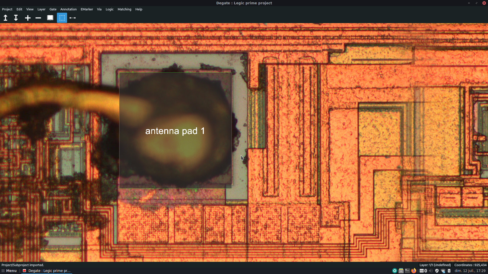
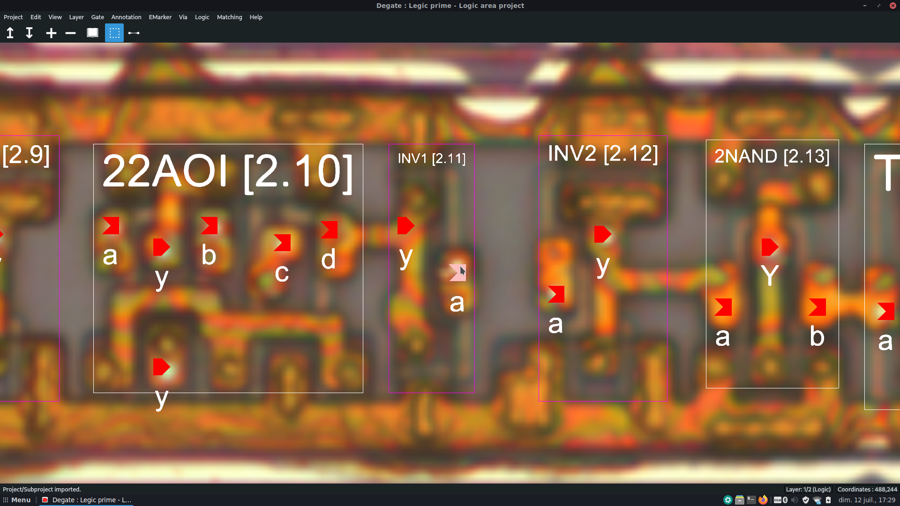
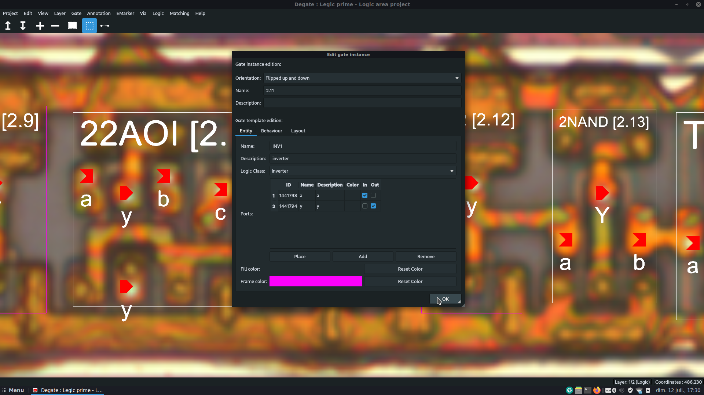

[](https://github.com/DegateCommunity)

<p align="center">
    <a href="https://gitter.im/DegateCommunity/Degate" alt="Gitter">
        </a>
    <a href="https://github.com/DegateCommunity/Degate/blob/master/LICENSE.TXT" alt="License">
        </a>
    <a href="https://github.com/DegateCommunity/Degate/issues" alt="GitHub Issues">
        </a>
    <a href="https://github.com/DegateCommunity/Degate/commits/develop" alt="Last Commit">
        </a>
    <a href="https://github.com/DegateCommunity/Degate/releases" alt="Last Release">
        </a>
    <a href="https://github.com/DegateCommunity/Degate/graphs/contributors" alt="Contributors">
        </a>
</p>

<p align="center">
        
        
        
</p>

&nbsp;

Degate is a multi-platform software for semi-automatic VLSI reverse engineering of digital logic in chips. This project is a fork of the initial Degate project, the final goal is to replace it. For more please visit our [wiki](https://github.com/DegateCommunity/Degate/wiki) page and, if you want to chat, visit our [Gitter](https://gitter.im/DegateCommunity/Degate). The current main maintainer of Degate is [Dorian Bachelot](https://github.com/DorianBDev).

&nbsp;

- [The project](#the-project)
  - [Little history](#little-history)
  - [Current status](#current-status)
  - [Future](#future)
  - [Documentation](#documentation)
  - [Screenshots](#screenshots)
- [Build](#build)
  - [Dependencies](#dependencies)
  - [Dependencies version](#dependencies-version)
  - [Quick start](#quick-start)
    - [For Linux (debian-like)](#for-linux-debian-like)
    - [For Windows](#for-windows)
    - [For MacOS](#for-macos)
- [Demo projects](#demo-projects)
- [Contributing](#contributing)
- [Localization](#localization)
  - [Help us](#help-us)
- [License](#license)

&nbsp;

# The project

## Little history

Degate was actively developed by Martin Schobert, during his thesis, from 2008 to 2011. For now, the project is inactive and only get some small fixes since 2011. The project is composed of a library (libGate) and a GUI interface (Degate).

Degate has definitely a great potential, mainly because it is the only free and open-source software for hardware reverse engineering of chips, but never knew how to impose itself in the community. One possible reason for that is because Degate was known to be unstable and have impacting bugs in a first place. 

You can visit the initial project website to learn more:

  http://degate.org

## Current status

This project aims to totally replace the old Degate, with a focus on Windows, Linux and MacOS support, getting better stability and general modernization. To achieve this the aim was to drop GTK and move to Qt and merge the lib and the GUI part of the project. Another objective was to minimize the number of dependencies, for now it uses only Boost and Qt and the mid-term objective is to only keep Qt and remove Boost.

The stability was the main problem of the old Degate and the main reason why the community hadn't already united around it. Regarding that, we want to have fewer bugs as possible, even if some functionality needs to be dropped (for the moment).

For the moment we have (as functionalities):
- OpenGL 3 support (better performances and evolutive),
- Qt (bunch of tools, open-source and easy cross-platform),
- Multi-platform support (official support for Linux, Windows and MacOS),
- Multi-language support (for now only English and French are implemented),
- UTF-8 support for the workspace (the main area of the software, where you can work on high-definition chips images),
- Backward compatibility of old Degate project format,
- Project configuration (elements color, project name, size...),
- Layers configuration (type, position, background image...),
- Gate and gate configuration (gate template, gate instance, behavior with VHDL and Verilog support and debugging),
- Via and via configuration,
- EMarker (Electric Marker) and emarker configuration,
- Interconnection (electric connection between electric objects),
- Template matching (for gates),
- Grid,
- Via matching (can be tricky),
- Wire matching (need a rework),
- Sub-projects,
- Annotation and annotation configuration,
- Light and dark theme support,
- Rule checks,
- Modules,
- Connection inspector,
- And much more...

We dropped those functionalities from old Degate:
- Collaborative tracking of wires and vias.

A lot of bugs were fixed in this newer version, and it should be a better base to improve Degate even more in the future.

## Future

There is still a lot to do in this new version, but all core functionalities (and even more) are implemented.

Future functionalities remaining to implement (not limited):
- Explicit full netlist exporter (new feature),
- More languages (new feature),
- Integrated gate analyzer (new feature).

For a more precise roadmap see the [ROADMAP.md](https://github.com/DegateCommunity/Degate/blob/develop/ROADMAP.md) file.

## Documentation

The official Degate documentation is available [here](https://degate.readthedocs.io). It is still under construction.

Also, you can find [here](https://github.com/DegateCommunity/Degate/wiki) the official Degate wiki. For example, you can find on it a list of tutorials for [Degate](https://github.com/DegateCommunity/Degate/wiki/Tutorials-:-Degate) and for [IC Reverse-Engineering](https://github.com/DegateCommunity/Degate/wiki/Tutorials-:-IC-Reverse-Engineering).

## Screenshots

 

 

 

 

# Build

## Dependencies

Degate has only 2 dependencies: Boost and Qt5.

For Boost, you can specify to CMake a custom path with: -DBOOST_ROOT="custom_path_to_boost". Prebuilt versions for Windows are available here: https://sourceforge.net/projects/boost/files/boost-binaries/.

For Qt5, you can specify to CMake a custom path with: -DCMAKE_PREFIX_PATH="custom_path_to_qt". For example, on Windows: Qt/VERSION/COMPILER/lib/cmake/Qt5. You can download Qt5 here: https://www.qt.io/download.

For Linux, don't forget to install the Qt5 add-on module: ImageFormats (you just need to have the package installed, it will be embedded in the Qt5::Core module after). See https://doc.qt.io/qt-5/qtimageformats-index.html. For example, on debian, the package is: qt5-image-formats-plugins. Same problem with linguist tools, for example for debian you need the package: qttools5-dev.

## Dependencies version

- CMake 3.12.0 or newer,
- Boost 1.70.0 or newer,
- Qt 5.14.0 or newer.

## Quick start

Firstly, clone this repository (help [here](https://docs.github.com/en/github/creating-cloning-and-archiving-repositories/cloning-a-repository)).

### For Linux (debian-like)

Install dependencies:
```console
> sudo apt-get install cmake g++ qt5-default qt5-image-formats-plugins qttools5-dev libboost-all-dev
```
Build (in the 'build' folder, for example):
```console
> cmake ..
> make
```
Binaries are in the 'build/out/bin' folder.

### For Windows

Install dependencies:
- CMake: https://cmake.org/download/
- A compiler (for example MSVC): https://visualstudio.microsoft.com/
- Qt: https://www.qt.io/download-qt-installer
- Boost: https://sourceforge.net/projects/boost/files/boost-binaries/

Build (in the 'build' folder, for example):
```console
> cmake .. -DBOOST_ROOT="path_to_boost" -DCMAKE_PREFIX_PATH="path_to_qt"
> cmake --build .
```
Binaries are in the 'build/out/bin' folder.

### For MacOS

Install dependencies (we will use [Homebrew](https://brew.sh) here) :
- XCode: https://apps.apple.com/app/xcode/id497799835

```console
> brew install boost
> brew install qt
```

Build (in the 'build' folder, for example):
```console
> cmake ..
> cmake --build .
```
Binaries are in the 'build/out/bin' folder in the bundle ".app" format.

## Troubleshooting

- `Could NOT find Boost (missing: filesystem system thread) (found version "1.71.0")`

  This message may be caused by default options which force to use static and multithreaded version of the Boost library.
  For example, this is a problem when installing Boost with **MacPorts** on MacOS because the installed version [does not provide a static version by default](https://gitter.im/DegateCommunity/Degate?at=6085183db6a4714a29e65fbb).
  To change these default options, you can use these two commands when calling cmake (ON/OFF):
  ```console
  > cmake .. -DBoost_USE_STATIC_LIBS=OFF -DBoost_USE_MULTITHREADED=OFF
  ```
  
  On Windows this can also be caused by an installed version of Boost that does not match your installed compiler.

# Demo projects

You can find demo projects [here](https://github.com/DegateCommunity/DegateDemoProjects).

# Contributing

Read the "CONTRIBUTING.md" file.

# Localization

## Help us

For now only English and French are supported, but if you wish you can help easily. Degate use Qt Linguist for translation, you can learn more here: https://doc.qt.io/qt-5/linguist-translators.html.
You can find .ts files (to use with Qt Linguist) in 'res/languages'.

Languages:
- English (100%),
- French (100%).
- German (80%),
- Russian (0%),
- Spanish (0%),
- Italian (0%),
- Korean (0%).

To add a new language opens a new issue.

# License

Degate is released under the GNU General Public License Version 3. See LICENSE.TXT for details.

The current main maintainer of Degate is **Dorian Bachelot** <dev@dorianb.net> and the original Degate maintainer is **Martin Schobert** <martin@mailbeschleuniger.de>.
